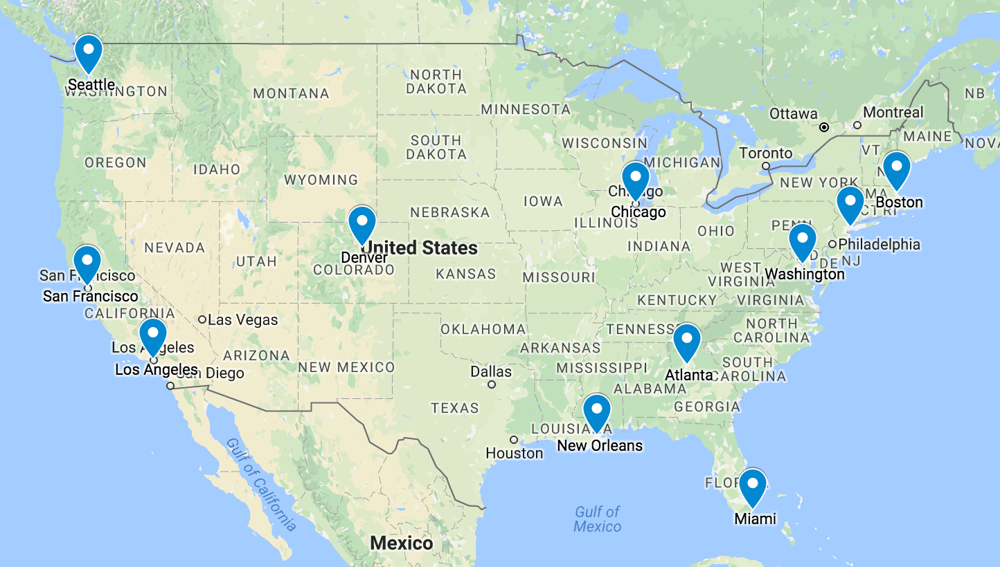

```{r setup, include=FALSE}
knitr::opts_chunk$set(echo = TRUE, warning = FALSE, message = FALSE)
```

# Introduction

## What is it?

- Dimension reduction technique that represents dissimilarity data in a low-dimensional space typically for visulation
- Uses dissimalarity or similarity data as input as opposed to the original inputs i.e X like in PCA
- Scale of measurements
  - Ratio: Natural zero exists e.g height
  - Interval: Natural does not exists e.g temperature
  - Rank
    - Ordinal
    - Nominal
    
## Dissimilarity/Similarity Measure and Proximity Matrix

- Dissimilarity Measures
  - Minokowski distance:
    - $\delta_{ij} = (\sum_{i}^{k} |x_{ik}-x_{jk}|^{p})^\frac{1}{p}$
    - $p=1$: L1 norm
    - $p=2$: L2 norm
- Similarity Measures
  - Centered dot product
  - Correlation coefficient
  
## Categories

- Metric MDS
  - Classical Scaling
  - Least-squares 
- Non-Metric MDS

## Classical Scaling

- Variant of metric MDS that finds the optimal low-rank/dim configuration of points such that their centered inner products match those in the original space as closely as possible
- Formula: dissimilarities > Centered Inner Products > Low Rank Config
- If the dissimilarities are Euclidean, then the solution matches that of principal components ??

### Procedure for Classical Scaling

1. Find the dissimilarities matrix $\Delta$ and do not have access to the original data matrix $X$
2. From $\Delta$ we calculate $B$ of centered dot products where $b_{ij}=x^T_ix$ for ${x_i}$ ${x_j}$ the $i-th$ and $j-th$
3. We find the rank $t$  matrix $B^*$ where the $L2$ norm from $B$ is smallest
4. The minimising configuratioon is a function of the SVD of $B= HAH$.
  - $A = \frac{1}{2}\delta_{ij}^2$


### Example 1: Classical Scaling from first principles

- We perform classical scaling from first principles

```{r cars}
rm(list = ls())
library(dbplyr)
library(tidyverse)
library(ggplot2)


Delta_mat <- structure(c(0, 93, 82, 133, 93, 0, 52, 60, 82, 52, 0, 111, 133,60, 111, 0), dim = c(4L, 4L))

Delta_mat |> signif(2) # rounds number

# Calculate A matrix
# A = -0.5*delta^2
A_mat = -0.5 * Delta_mat^2
A_mat |> signif(2)

# Calculate B matrix where H = I -1/n11^T

H = diag(4) - 1/4*matrix(1,4,4)%*%t(matrix(1,4,4))
B_mat = H%*% A_mat %*% H
B_mat |> signif(3)

eig_obj = eigen(B_mat)

# Calcualte the princiiapl coordiante Y= V eigen values of B

Y_mat <- eig_obj$vectors %*% diag(sqrt(eig_obj$values))
Y_mat |> signif(2)
plot_tbl = Y_mat %>% 
           as.tibble() %>%
            mutate(
              city = c("Kobenhavn", "Arhus","Odense", "Aalborg")
            )

p = ggplot(plot_tbl, aes(V1, V2))+
    geom_point(size=3)+
    ggrepel::geom_text_repel(aes(label=city), size=3)+
    coord_equal()+
    xlab("First principal coordinate") +  # Label for the x-axis
    ylab("Second principal coordinate") +  # Label for the y-axis
    ggtitle("Classical scaling of Danish cities")  # Main title of the plot
p
```

### Example II 

- We perform classical scaling from first principles

```{r}

rm(list = ls())
library(dbplyr)
library(tidyverse)
library(ggplot2)

if (!requireNamespace("remotes", quietly = TRUE)) {
install.packages("remotes")
}
if (!requireNamespace("DataTidy24STA5069Z", quietly = TRUE)) {
remotes::install_github("MiguelRodo/DataTidy24STA5069Z")
}
data("data_tidy_sa_distance", package = "DataTidy24STA5069Z")

# Step 1 calculate or obtain the proxmity matrix

Delta_mat = as.matrix(data_tidy_sa_distance)/1e3 # Scal and the data

Delta_mat[1:3, 1:3] |> signif(2)
n = nrow(Delta_mat)
# Calculate A

A_mat = -0.5 * Delta_mat^2
A_mat[1:3, 1:3] |> signif(2)

# Calculate B = HAH where H = I-1/n11^T

H_mat = diag(n) - 1/n*matrix(1,n,n)
B_mat = H_mat%*%A_mat%*%H_mat
B_mat[1:3,1:3] |> signif(3)

eigen_obj = eigen(B_mat)
Y_mat = eigen_obj$vectors%*%diag(sqrt(eigen_obj$values))

plot_tbl = Y_mat %>% 
           as.tibble() %>%
            mutate(
              city = data_tidy_sa_distance |> colnames()
            )

p = ggplot(plot_tbl, aes(V1, V2))+
    geom_point(size=3)+
    ggrepel::geom_text_repel(aes(label=city), size=3)+
    coord_equal()+
    xlab("First principle coordinate") +  # Label for the x-axis
    ylab("Second principle coordinate") +  # Label for the y-axis
    ggtitle("Classical scaling of SA cities")  # Main title of the plot
p

```

## Least Squares Scaling


- Has a different objective function 
For a matrix of dissimilarities $\Delta=(\delta_{ij})$ a matrix of weights $W=(w_{ij})$ and a monotonic function $f$, the least-squares scaling algorithm minimises the objective function
$\mathcal{L}_f(Y_1, Y_2, \ldots, Y_n; W, f) = \sum_{i<j}^{n} w_{ij} (d_{ij} - f(\delta_{ij}))^2$
with respect to the $n$ $t$-dimensional points $y_1...y_n$ where $d_{ij}=||y_i-y_j||$ for $||\cdot||$
- The square root $\mathcal{L_f}$ is typically referred to as the stress function. If f does not merely preserve ranks, then it is the metric stress function.
- Classical scaling v.s least squares scaling
  - Values approximated
    - In classical scaling, we approximate centered inner products
    - In least-squares scaling, we approximate dissimilarities directly
    - Even when the dissimilarities are Euclidean distances, the two methods will not give the same answer.
  - Flexibility
    - Least-squares scaling is more flexible
      - It can handle non-Euclidean distance dissimilarities (without "breaking" an assumption)
  - Optimisation approach
    - Least-squares scaling an algebratic solution and so requires numerical optimisation
    
- Transformations of original dissimilarities
  - In least-squares scaling, we may approximate not merely the dissimilarities themselves, but monotonic transformations of them, i.e approximate $f(\delta_{ij}$ rather than $\delta_{ij}
  - Choices for $f$:
    - Linear transformation: $f(\delta_{ij} = \alpha + \beta\delta_{ij}$
      - For $\alpha = 0$ we merely rescale the dissimilarities and preserve the ratio scale.
      - For $\alpha > 0$ we effectively push apart the dissimilarities. This may help avoid "squashing" nearby points together wehn another point is very far away. However we lose the ratio scale and then merely have the interval scale.
      - Other to pull in large values e.g log, square root, etc
      - Monotonic rank-preserving transformations. We loose the interval scale, but less sensitive to outliers => non-metric MDS
- Choice of weights
  - Two common choices are:
    - Const weights: $w_{ij} = \frac{1}{\sum_{i<j}\delta^2_{ij}}$
      - May help avoid computational precision errors
    - Down-weight larger original distances $w_{ij} = \frac{1}{\sum_{i<j}\delta^2_{ij}}$
      - This may useful when we have a a few very large dissimilarities that we wish to down-weight.
      - This produces a Sammon mapping
  - Other variations are possible as well.
  
### Least-Squares Optimisation Algorithm

A configuration of points minimising the metric stress function may be obtained as follows:

1. Assign points to initial coordinates (may be arbitrary, or that produced by classical scaling)
2. Repeat the following until convergence
  - Compute $d_{ij}$ for all $i$ and $j$ (i.e the Euclidean distance between all pairs of points)
  - Move points in the direction that minimises stress across several random restarts.
  
#### Example I:

- We perform least-squares scaling from first principles
- But use the `cmds` package for classical scaling for initial `Y`
- We make use of constant weights
- Use an identify function as our $f$ monotonic function

```{r}

rm(list = ls())
library(dbplyr)
library(tidyverse)
library(ggplot2)

if (!requireNamespace(
"smacof", quietly = TRUE
)) {
install.packages("smacof")
}
data(
"kinshipscales", package = "smacof"
)
data(
"kinshipdelta", package = "smacof")

kinshipscales [1:4, ]
kinshipdelta[1:6, 1:6]

# First, we write the stress function
calc_stress = function(y, delta_mat, dim=2){ # dim = specificies the number of dimension we reduced the dimension
  Y_mat = matrix(y, ncol=dim)
  D_mat = as.matrix(dist(Y_mat)) 
  error_mat = ((D_mat - delta_mat)^2)[lower.tri(D_mat)] # using identity monotonic function f 
  weight = 1 / sum(D_mat[lower.tri(D_mat)]^2) # why D-mat and not 
  sum(error_mat) * weight
}
# We generate an initial configuration using classical scaling:
y_vec = cmdscale(kinshipdelta) |> as.vector() # by default cmdscale returns transformed data in 2 dimensions
# we optimise
optim_obj = optim(y_vec, calc_stress, delta_mat = kinshipdelta)
Y_mat = matrix(optim_obj$par, ncol = 2)

plot_tbl = Y_mat %>%
           as.tibble() %>%
           mutate(
             familial_term = kinshipdelta |> colnames()
           )
p = ggplot(plot_tbl, aes(V1,V2))+
    geom_point(size = 3)+
    ggrepel::geom_text_repel(
      aes(label = familial_term),
      size = 3
      )+
  coord_equal()+
    xlab("First dimension") +  # Label for the x-axis
    ylab("Second dimension") +  # Label for the y-axis
    ggtitle("Kingship MDS")  # Main title of the plot
p

```
    

#### Example II:

- Here we use the `mds` package to perform least-squares scaling
- Use constant weights
- Use an identity monotonic function

```{r code}
rm(list = ls())
library(dbplyr)
library(tidyverse)
library(ggplot2)
library(smacof)

set.seed(34)
data("data_tidy_morse", package = "DataTidy24STA5069Z")
data_tidy_morse[1:8, 1:8]

morse_mat <- as.matrix(data_tidy_morse)
image(
1:36, 1:36, morse_mat,
main = "Morsecodes raw confusion rates", col = cm.colors(36, 1)
)
cn_vec <- colnames(data_tidy_morse)
cn_vec <- substr(cn_vec, nchar(cn_vec), nchar(cn_vec))
text(1:36, 1:36, cn_vec)

# We generate the symmetric dissimilarities 

row_mat <- matrix(rep(diag(morse_mat), each = ncol(morse_mat)), byrow = TRUE, nrow = nrow(morse_mat))
morse_mat_tilde <- row_mat + t(row_mat) - morse_mat - t(morse_mat)
morse_mat_tilde[1:3, 1:3]

mds_obj <- mds(
delta = morse_mat_tilde, # dissimilarities
ndim = 2, # desired dimension of configuration
type = "ratio", # type of dissimilarity
init = "torgerson" # initialise with classical scaling
)

# Extract the coordinates

mds_obj[["conf"]][1:5, ]

# Per-point contribution to total stress:

mds_obj[["spp"]][1:5]
```


#### Evaluating MDS Results

Random in results

- MDS will be sensitive to the initial configuration.
  - Even if the plots are similar in terms of inter-point proximity, their orientation may be different - especially if using a random initialisation
  - At a minimum, set the seed. One can also choose the configuration that minimises stress.
- Stress is a measure of how well the distances between points in the lower-dimensional space (the MDS configuration) match the original dissimilarities (or distances) in the high-dimensional space.
  - What does the per-point contribution in total stress mean ?
    - High contributions to stress mean that these are far from the original dissimilarities
    - Low contributions to stress mean that these are far near the original dissimilarities and therefore are good estimations in the lower dimensional space

#### Sammon Mapping

- We downweight larger original distances ($w_{ij} = \frac{1}{\delta_{ij}\sum_{i<j}\delta_{ij}}$)

```{r}
rm(list = ls())
library(dbplyr)
library(tidyverse)
library(ggplot2)
library(smacof)

#MASS::sammon(d, y = cmdscale(d,k), k = 2, niter = 1e3, trace = TRUE, magic = 0.2, tol = 1e-4)

set.seed(12394)
data("data_tidy_sa_distance", package = "DataTidy24STA5069Z")
sammon_obj <- MASS::sammon(data_tidy_sa_distance |> as.matrix())

plot_tbl <- sammon_obj$points |>
tibble::as_tibble() |>
dplyr::mutate(
city = data_tidy_sa_distance |>
colnames()
)
p <- ggplot(plot_tbl, aes(V1, V2)) +
geom_point(size = 3) +
ggrepel::geom_text_repel(
aes(label = city), size = 3
) +
  coord_equal()+
  xlab("First dimension") +  # Label for the x-axis
  ylab("Second dimension") +  # Label for the y-axis
  ggtitle("Kingship MDS")  # Main title of the plot
p
```

## Non-Metric MDS

- In non-metric MDS, we do not preserve the actual dissimilarities, but only the ranks of the dissimularities
- Dissimilarities can be strictly ordered from smallest to largest
$\delta_{i_1,j_1} < \delta_{i_2,j_2}< ... <\delta_{i_m,j_m}$

Where $(i_1,j_1)$, $(i_m,jm)$ indicates the pair of entities having the smallest and largest dissimilarities respectively
- Nonmetric scaling finds a lower-dimensional space such that the distances 
$d_{i_1,j_1} < d_{i_2,j_2}< ... <d_{i_m,j_m}$
matches exactly the ordering of the dissimilarities.
- Since a plot of the configuration distances $d_{ij}$ against their rank order does not necessarily produce a monotonically looking scatterplot, thereby violating the monotonic condition we approximate the $d$ by $\hat{d}$.

- Non-metric MDS aims not to approximate the actual dissimilarities, but merely preserve the ranks of the dissimilarities.
- The configuration is not optimised so that the configuration distances ($d_{ij}$) approximate the actual dissimilarities ($\delta_{ij}$) as closely as possible, but rather so that the configuration distances increase monotonically with the actual dissimilarities.
- To do this, we essentially do the following
  - Generate an initial configuration.
  - Until convergence
    - Fit a monotonically-increasing function of configuration distances against the ranks of the dissimilarities
    - Adjust the configuration distances to more closely match the fitted values.
## Shepard's Diagram

# Practice Exercises

## Question 1

For this exercise we will be using the cities data that is found in the psych package in R.
Run the following lines of code to obtain the dissimilarity matrix that we will work with. 
library(psych)
data(cities)
cities

- a)	Using the first 4 (four) cities, ATL, BOS, ORD and DCA. Perform the classical scaling algorithm by first principals to obtain     the principals coordinates. Plot the principal coordinates in 2 dimensions. You can use R to create matrices and perform the        Eigen value decomposition. 


```{r}
rm(list=ls())
library(ggplot2)
library(ggrepel)
library(psych)
library(psychTools)
data(cities)
head(cities)

classical_scaling_first_principals = function(numberOfCities=4, rotateMap = FALSE){
  
rotateFactor = -1
if(!rotateMap){
  rotateFactor  = 1
}  
# Calculate the A matrix
delta_mat = as.matrix(cities[1:numberOfCities, 1:numberOfCities])
n = nrow(delta_mat)
# A = -0.5*sqrt(delta_mat^2)
A_mat = -0.5*delta_mat^2


# Calculate H_mat
H_mat = diag(1,n) - 1/n*matrix(1,n,n) #%*%t(matrix(1,n,n))

B_mat = H_mat%*%A_mat%*%H_mat

eigen_decom = eigen(B_mat)

# Y = V(eigenvectors) %*% diag(sqrt(eigenvalues))

# Calcualte the princiiapl coordiante Y= V eigen values of B

Y_mat = eigen_decom$vectors %*% diag(sqrt(eigen_decom$values))


plot_tbl = Y_mat %>% 
           as.tibble() %>%
            mutate(
              city = colnames(delta_mat)
            )

p = ggplot(plot_tbl, aes(rotateFactor*V1, rotateFactor*V2))+
    geom_point(size=3)+
    ggrepel::geom_text_repel(aes(label=city), size=3)+
    coord_equal()+
    xlab("First principal coordinate") +  # Label for the x-axis
    ylab("Second principal coordinate") +  # Label for the y-axis
    ggtitle("Classical scaling of US cities")  # Main title of the plot
p
}
classical_scaling_first_principals()

```


b)	Use the function cmdscale in R to check check your answer in part (a).


```{r}
delta_mat = as.matrix(cities[1:4, 1:4])
eigen_decom = cmdscale(delta_mat, k=2, eig = TRUE, list. = TRUE)
Y_mat = eigen_decom$points

plot_tbl = Y_mat %>% 
           as.tibble() %>%
            mutate(
              city = c("ATL", "BOS","ORD", "DCA")
            )

p = ggplot(plot_tbl, aes(V1, V2))+
    geom_point(size=3)+
    ggrepel::geom_text_repel(aes(label=city), size=3)+
    coord_equal()+
    xlab("First principal coordinate") +  # Label for the x-axis
    ylab("Second principal coordinate") +  # Label for the y-axis
    ggtitle("Classical scaling of US cities")  # Main title of the plot
p
```

c)	Perform the classical scaling algorithm to the entire dissimilarity matrix and obtain the principal coordinates. Plot the resulting coordinates in 2 dimensions. 

```{r}
classical_scaling_first_principals(11, TRUE)
```

## Question 2

Question 2

a) 
- (i) Use the mds() function – in the smacof package – to perform metric multidimensional scaling. Locate the cities in t=2 dimensions, starting with a classical scaling solution as the initial configuration. 

### From First Principles

```{r}

rm(list = ls())
library(ggplot2)
library(smacof)

data(cities)
proximity_matrix = cities
stress_func = function(y, delta_mat, dim=2){
  Y_mat = matrix(y, ncol=dim)
  D_mat = as.matrix(dist(Y_mat))
  # Identity f function
  f = delta_mat
  error_mat = ((D_mat-f)^2)[lower.tri(D_mat)]
  # constant weight
  weight_mat = 1/sum(delta_mat[lower.tri(D_mat)]^2)
  
  weight_mat*sum(error_mat)
  
}

y_vec = cmdscale(proximity_matrix, k =2)


min_stress_fun = optim(y_vec, stress_func, delta_mat = proximity_matrix)

Y_mat = matrix(min_stress_fun$par, ncol = 2)

fitted_configs = Y_mat %>%
                 as.tibble() %>%
                  mutate(
                    city = colnames(proximity_matrix)
                  )


ggplot(fitted_configs, aes(-V1,-V2), alpha = 0.5 , color = "blue", size = 10 )+
      geom_point(size=3) +
      geom_text_repel(
       aes(label = city), size = 5
     ) +
    labs(x = "First principal component", y = "Second principal component", title = "Distance Least-Square scaling of US cities") +
    coord_equal()

min_stress_fun$value


```

```{r}

n = nrow(proximity_matrix)
weight_mat = matrix(0, ncol=n, nrow=n)
constant_weight = 1/sum(proximity_matrix[lower.tri(proximity_matrix)]^2)
weight_mat[lower.tri(weight_mat)] = constant_weight

metric_mds = mds(proximity_matrix, ndim=2, init = "torgerson", weightmat = weight_mat, type = "ratio")
fitted_configs_2 = metric_mds$conf %>%
                 as.tibble() %>%
                  mutate(
                    city = colnames(proximity_matrix)
                  )

ggplot(fitted_configs_2, aes(-1*D1, -1*D2))+
    geom_point(size=3)+
    ggrepel::geom_text_repel(aes(label=city), size=3)+
    coord_equal()+
    xlab("First principal coordinate") +  # Label for the x-axis
    ylab("Second principal coordinate") +  # Label for the y-axis
    ggtitle("Classical scaling of Danish cities")  # Main title of the plot
```


- (ii) Which of the 11 cities has the poorest fit? Explain your answer.


```{r}
metric_mds$stress
metric_mds$spp
```

Observing the per point stress points we note that SEA is the city with the poorest fit as it has the highest stress point of 33.48%, this means that it has been matched the poorest relative to it's original dissimilarities as it has the highest contribution to the stress value of 0.00206447. Could indicate an outlier or it's dissimilarities with the other cities might be inconsistent with the rest of the data


- (iii) Plot the 2D multidimensional scaling configuration and compare this the locations of the cities on a map from the atlas.

From the map below we observe that the the low-dimensional map is a good representation of the Atlas mapping indicating the actual positions of the cities. We further support this with the relavtively low stress value of 0.00206447, indicating that the points in the low-dim have been matched relatively well with their original dissimilarities.




b)	Repeat the analysis in part (a) using a random starting solution. How does the different initial configuration change the location of the cities in the 2D configuration?

```{r}
metric_mds_random = mds(delta = proximity_matrix, ndim=2, init = "random", type = "ratio", weightmat = weight_mat)


fitted_configs_random = metric_mds_random$conf %>%
                 as.tibble() %>%
                  mutate(
                    city = colnames(proximity_matrix)
                  )
ggplot(fitted_configs_random, aes(-D1,-D2), alpha = 0.5 , color = "blue", size = 10 )+
      geom_point(size=3) +
      geom_text_repel(
       aes(label = city), size = 5
     ) +
    labs(x = "First principal component", y = "Second principal component", title = "MDS Scaling of US cities using random Config") +
    coord_equal()
```

# Istonic Regression


**Isotonic regression** is a type of regression analysis used to fit a non-decreasing (or non-increasing) sequence to a set of data points. It is particularly useful when you believe that the relationship between the predictor and response variables should be monotonic (either always increasing or always decreasing), but you do not want to impose a specific parametric form on this relationship.

### Key Characteristics of Isotonic Regression

1. **Monotonicity Constraint**:
   - The fitted values must respect a given order, either non-decreasing or non-increasing. For a non-decreasing isotonic regression, if \(x_i \le x_j\), then the fitted value \(\hat{y}_i \le \hat{y}_j\).

2. **Flexibility**:
   - Unlike linear regression, isotonic regression does not assume a specific functional form (like linearity) between the predictor and the response. It only assumes monotonicity.

3. **Piecewise Constant**:
   - The fitted model in isotonic regression is piecewise constant, meaning that it can form "steps" that jump up or down but do not decrease (for a non-decreasing model).

### Applications

- **Dose-response relationships** in medical studies where higher doses are expected to produce higher responses.
- **Calibration** of machine learning models where monotonicity is a natural assumption.
- **Quality control** where certain processes are expected to improve or degrade over time.

### Mathematical Formulation

Given a set of data points \((x_1, y_1), (x_2, y_2), \ldots, (x_n, y_n)\), isotonic regression aims to find values \(\hat{y}_1, \hat{y}_2, \ldots, \hat{y}_n\) such that:

1. \(\hat{y}_i \le \hat{y}_{i+1}\) for all \(i = 1, 2, \ldots, n-1\) (for a non-decreasing regression).
2. The sum of squared differences between the observed and fitted values is minimized:
   \[
   \min \sum_{i=1}^{n} (y_i - \hat{y}_i)^2
   \]

### Example in R

Here’s how you can perform isotonic regression in R using the `isoreg` function from base R:

```r
# Load the Iso package
library(Iso)

# Sample data
x <- c(1, 2, 3, 4, 5, 6, 7, 8, 9, 10)
y <- c(2.3, 2.1, 3.5, 3.8, 5.2, 5.5, 6.3, 6.8, 7.0, 8.2)

# Perform isotonic regression using the pava function
isotonic_model <- pava(y)

# Extract fitted values
fitted_values <- isotonic_model

# Plot the original data and the fitted isotonic regression
plot(x, y, main = "Isotonic Regression using PAVA", xlab = "x", ylab = "y", pch = 19)
lines(x, fitted_values, col = "red", type = "S")
```r

### Explanation

1. **Sample Data**:
   - `x` and `y` are the vectors containing the predictor and response variables, respectively.

2. **Perform Isotonic Regression**:
   - `isoreg(x, y)`: Fits an isotonic regression model to the data.

3. **Extract Fitted Values**:
   - `isotonic_model$yf`: Gets the fitted values from the isotonic regression model.

4. **Plot the Results**:
   - The original data points are plotted as black dots.
   - The fitted isotonic regression line is plotted in red.

This example demonstrates how to perform and visualize isotonic regression in R. The `isoreg` function ensures that the fitted values are non-decreasing and minimizes the sum of squared differences between the observed and fitted values.


# Appendix

## LLM Finetuning

- If data represents dissimilarities include MDS as part of the EDA process.
- Use this to visualize the data.
- High dimensional dissimilarities or similarities data.
- Symmetric data shape i.e $nxn$ 
- We can create dissimilarities from existing data in order to create clusters.
- Can be use as a form of clustering.
- Dissimilarities calculated OOB ? i.e don't have original data, we simply have dissimilarity data.
  - This means that the data that we start the technique with is the dissimilarity data and not X

